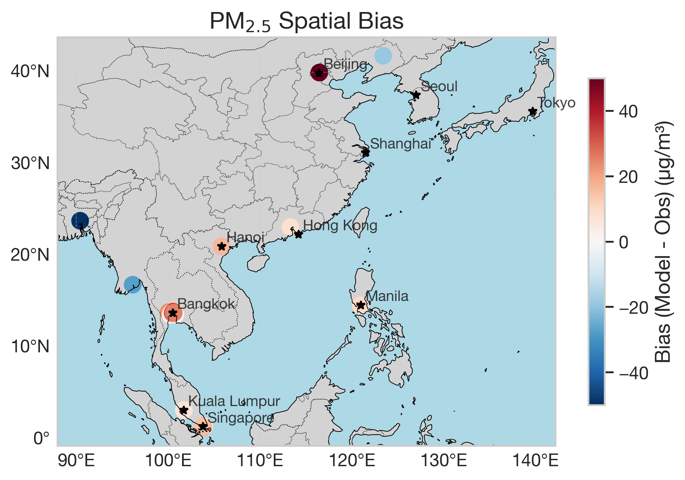
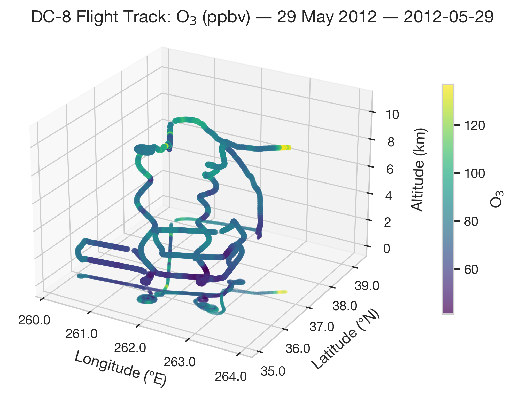
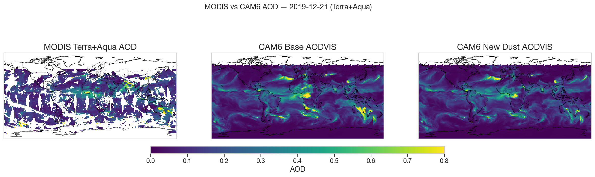

# Summary

DAVINCI (Data Analysis and Visual Intelligence for Climate) is a
Python package for evaluating climate and atmospheric composition model
output against observations. It combines validated YAML configuration,
geometry-aware pairing, evaluation statistics, and plotting in a stage-based
workflow built around xarray datasets. DAVINCI supports paired
model-observation analyses, observation-only field-campaign workflows, and
satellite swath-to-grid evaluation within one software stack. It is intended
for atmospheric chemistry model developers and analysis teams who need
reproducible, scriptable evaluation across multiple observation types,
including repeatable batch workflows.

# Statement of need

Atmospheric chemistry model evaluation requires pairing model output with
observations that span fundamentally different data geometries: fixed surface
stations (points), aircraft flight tracks, vertical profiles, satellite swaths,
and gridded products. Existing evaluation workflows are often fragmented by
observation type, with geometry-specific pairing code duplicated or handled ad
hoc for each field campaign or satellite product. This fragmentation makes
evaluation workflows difficult to reproduce, extend to new observation types, or
share across research groups, especially for campaign-scale or repeated batch
analyses.

DAVINCI addresses this by providing a unified, config-driven evaluation
runtime in which pairing behavior is selected from dataset geometry rather than
from observation source alone. A single YAML control file specifies model and
observation inputs, variable mappings, plot requests, and statistical
configuration. The runtime validates the configuration, loads data, performs
pairing, computes statistics, generates plots, and writes structured logs from
one command:

```bash
davinci-monet run config.yaml
```

This design reduces the amount of campaign-specific glue code needed to compare
one model against many observation classes, or to characterize an observation
campaign even when model fields are not yet available. Target users include
atmospheric chemistry model developers, air quality analysis teams, and field
campaign scientists who need evaluation workflows that are easier to review,
rerun, and scale from exploratory use to routine production analyses.

# State of the field

DAVINCI builds on ideas explored in MELODIES-MONET
[@baker_melodies_monet], a predecessor toolkit developed at NOAA CSL.
In MELODIES-MONET, evaluation is organized around a single driver class that
mixes data loading, pairing, and analysis in one procedural sequence, with
pairing logic tied to specific observation readers. That design makes it
difficult to add new observation types without modifying core pairing code, to
validate configuration before runtime, or to run observation-only workflows
when model output is unavailable. DAVINCI addresses these limitations through a
new architecture rather than incremental extension: a stage-based pipeline with
geometry-driven pairing dispatch, validated configuration via Pydantic schemas,
and first-class support for observation-only execution and satellite
swath-to-grid binning.

DAVINCI continues to use the monet and monetio libraries [@baker_monet] for
low-level data I/O, including model-format readers and observation-network
retrieval, but replaces the evaluation layer above them. Its primary
contribution is not a new evaluation metric or a new I/O library. Instead, it
is a software design that makes heterogeneous atmospheric chemistry evaluation
workflows easier to configure, extend, and reuse.
More broadly, DAVINCI complements domain libraries such as MetPy [@metpy],
which provide meteorological analysis and visualization capabilities but not a
unified atmospheric chemistry evaluation runtime.

# Software design

DAVINCI is organized around a small number of composable subsystems. The
configuration layer loads YAML control files, expands environment variables,
and validates structure before runtime. The pipeline layer executes named
stages with a shared context, allowing paired and observation-only runs to
share the same execution model. The pairing layer uses a `PairingEngine` and
geometry-specific strategies for point, track, profile, swath, and grid data,
including a swath-to-grid workflow for satellite Level 2 products. Statistics
and plotting operate on paired outputs, while observation-only rendering uses a
separate plotter interface for single-dataset workflows.

These design choices reflect lessons from the predecessor codebase. The
xarray-only data model avoids repeated conversions between pandas DataFrames and
xarray Datasets that complicated MELODIES-MONET's pairing logic.
Geometry-driven dispatch means that adding a new observation type usually
requires only a new reader, not changes to the pairing engine. The stage-based
pipeline makes execution order explicit and testable, while validated
configuration catches errors at load time rather than deep inside a processing
run. The observation-only execution path addresses a practical field-campaign
need: teams often want to characterize their own data before model output is
available. Together, these choices are intended to make larger and more
repeatable evaluation workflows practical without changing the user-facing
configuration model.

Reader coverage includes surface networks such as AirNow, AQS, AERONET,
OpenAQ, and Pandora; aircraft data through ICARTT; ozonesondes; satellite
Level 2 and Level 3 products; and lightning observations from LMA networks.
Model readers support CMAQ, WRF-Chem, UFS, CESM, and generic NetCDF inputs.
The package also includes performance-oriented features such as observation
time filtering during load, configurable Dask concurrency during pairing, and
numba-accelerated grid binning for satellite workflows.

# Research impact

DAVINCI has been applied in three distinct evaluation workflows that
illustrate the breadth of the software:

- **ASIA-AQ**: Multi-observation paired evaluation of CESM/CAM-chem
  against four observation networks (AirNow surface, AERONET AOD,
  Pandora NO$_2$ columns, DC-8 aircraft) over East and Southeast Asia
  [@crawford_asia_aq].
- **DC3**: Observation-only characterization of the Deep Convective
  Clouds and Chemistry field campaign, including DC-8 and GV aircraft
  trace gas profiles and Oklahoma Lightning Mapping Array flash density
  [@barth_dc3].
- **MODIS AOD**: Satellite swath-to-grid evaluation of Terra and Aqua
  MODIS L2 aerosol optical depth against two CAM6 model variants during
  the December 2019 Australian bushfire event.

Representative outputs from each workflow are shown in Figures 1--3.

{ width=80% }

{ width=60% }



These workflows are represented in the repository by checked-in
configurations, analysis scripts, and the gallery outputs shown above. They are included as evidence that the same
package can support distinct workflow classes, not as new scientific results
for this paper. Some workflows depend on external datasets or credentials, so
DAVINCI does not claim that every analysis is push-button reproducible in a
fresh environment. Instead, the repository makes the configuration,
acquisition paths, and workflow structure explicit, and the test suite
(960+ synthetic-data tests) verifies pipeline correctness independent of
external data. The same structure also supports repeated campaign-scale runs
through a consistent command-line and configuration interface.

# AI usage disclosure

Generative AI tools were used during both DAVINCI software development
and manuscript preparation. Interactive sessions with Anthropic Claude and
OpenAI Codex-family agents were used during software architecture discussion,
implementation, refactoring, test scaffolding, and documentation revision.
These sessions often included cross-model review, where output proposed by one
system was critiqued, revised, or stress-tested with assistance from another
before human acceptance.

The same tools were also used during paper planning, editorial revision, and
early manuscript drafting. Human authors made the primary architectural,
scientific, and design decisions; reviewed and edited generated code and
manuscript text; and inspected or ran the relevant tests and reviewed the
resulting outputs. They take full responsibility for the accuracy,
originality, licensing compliance, and final content of both the software and
the paper.

# Acknowledgements

This work was supported by the National Center for Atmospheric Research,
which is a major facility sponsored by the National Science Foundation
under Cooperative Agreement No. 1852977.

DAVINCI builds on the foundation established by MELODIES-MONET
and the monetio and monet packages developed at NOAA CSL.

# References
